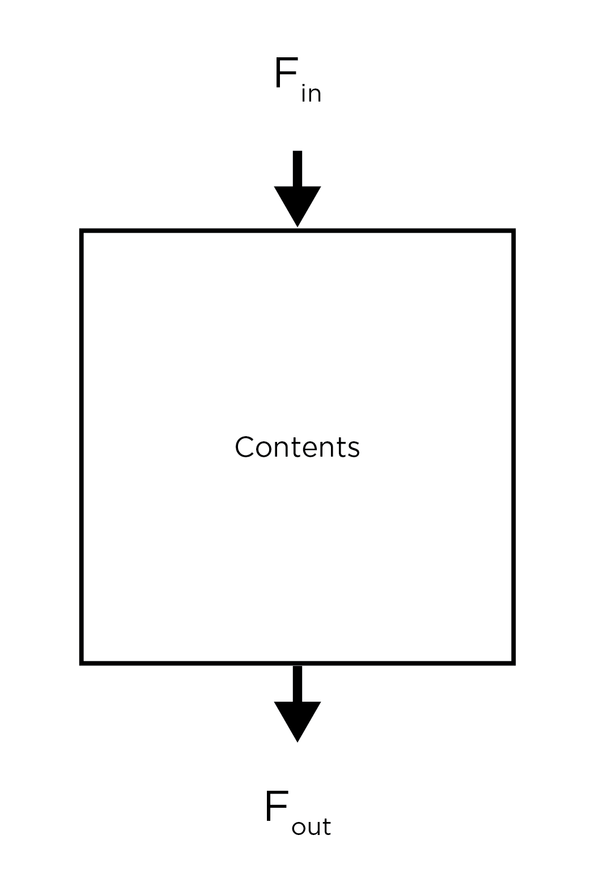

# Week 3: Two short exercises and some notes

## Exercises

This week, we will have a single assignment, with two parts. 

1. Given a real number *a*, a time step *deltaT*, and a span of time made up of a start value *timeStart* and an end value *timeEnd*, write a function that: 1) produces a vector of time values, *tValues*, from *timeStart* to *timeEnd*, with spacing *deltaT*, 2) creates a second vector, *aValues*, of equal length to the first, whose elements all have the value *a*, and 3) plots time vs *a*. Name the function something like **constantSignal**. 
Two hints:
    - If the first line in your function is `close all`, Matlab will close any open figure windows before proceeding. 
    - The function `plot(x, y)` will plot the values in `x` and `y` as a line. See `doc plot` for more information. 

    The function above can be thought of as a simulation of a system at **[steady state](https://en.wikipedia.org/wiki/Steady_state)**. We can represent such a system using a simple box model:
    
    which has some input flux (Fin), some output flux (Fout), and a *reservoir* with some contents. At steady state, Fin = Fout. Imagine, for example, you fill up a bathtub with water (i.e., the contents). Then, you open the drain. If the amount of water coming out of the faucet (i.e., the input flux) is exactly the same as the amount of water leaving down the drain (i.e., the output flux), the water level in the bathtub will not change.
2. Now, say we want to understand what happens if Fin is not equal to Fout, using the vectors that we output in step 1 as a starting point. Write a function that accepts the variables *tValues* and *aValues*, along with a perturbation time *pT*, and perturbation values *fIn* and *fOut*. Your function, titled something like **perturbationTest**, should:
    - Create a new vector called *perturbedValues*.
    - At each time step, decide whether the value of *a* should be updated (hint, if the time is less than the value of *pT*, nothing should change). If nothing should be done, the value of *a* should be copied into *perturbedValues*.
    - If it is necessary to update, add the value of *fIn* to the last value inserted into *perturbedValues* and subtract the value of *fOut* from the result, then store the final value in *perturbedValues*.
    - Plot *perturbedValues* against time. 
    - Also plot up the original values of *a* vs. time on the same figure (hint: use the function `hold on`).
    - Output *perturbedValues*. 
3. For 1 and 2, use the following values for variables:
    Variable | Value
    --- | ---
    *a* | 100
    *timeStart* | 1
    *timeEnd* | 100
    *deltaT* | .01
    *pT* | 25
    *fIn* | 10
    *fOut* | 5

    Note: run the function in step 2 twice, flipping the values of *fIn* and *FOut*.

## Some thoughts
- This week, we'll discuss how to create layered plots and, most importantly, how to debug. Notes for these topics will be uploaded later in the week. 

